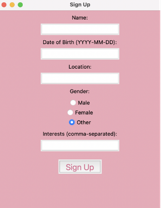

# The Matchi App

## Section 1 - Database Structure

A relational database was developed for this project. The schema can be accessed here: https://app.quickdatabasediagrams.com/#/d/QvkzNp

The basic design principle is to minimize interactions with the database unless absolutely necessary. This is designed with real-world applications in mind, where connections to databases can be expensive. We work primarily with objects in our program. 

The decision to work with relational database is rooted in the design decision to minimize string manipulation, thus speeding up querying and database updates. For example, if a user removes a liked user, that row will be deleted from the database. No further database updates will need to be made. 

Each user's basic information is stored in the *user* table. This table has one-to-many relationships with the rest of the tables in the database, where a user can have multiple interests, liked users, matches, etc. 

The program will interact with the database when:
  1. A user is created;
  2. User information is updated;
  3. A user likes or dislikes another user;
  4. A match is made; and
  5. A user views their own profile.

### Sample Database

A sample database with fake names, created using the *faker* library, is available in this repo for testing purpose.

## Section 2 - Terminal Interface
### Overview
The Matchi App mainly uses terminal-based interface for the matching system. It allows users to sign up, login, edit their profiles,
manage their liked users, brose through other user profiles and view their own profiles. This system is built using Python and SQLite.

### Features
#### User Login
Existing users can login using their user-id, they can access edit profile functions, edit liked users, browse user profiles, 
view own profiles, delete the account if no intention to future use and logout.
#### User Signup
New users can create an account by providing their name, birthdate, gender, location，and interests. The system will 
generate a unique user ID, which the user should save for future logins.
#### Edit Profile
Logged-in users can update their profile information, including name, birthdate, gender, location and interests.
Users will be required to enter all the information to make the update.
#### Remove Liked Users
Logged-in users can remove any other user in their liked list. The user need to enter the corresponding index 
(starting from 0) in the list to remove the user
#### Browse User Profiles
Logged-in users can browse through other user profiles, and can either like or dislike them. The system automatically find 
top ten users based on age, location and shared interests. 
After the user go through all the ten users, they can choose to continue browsing for new ten users.
User must choose whether like/dislike for certain profile. 
#### View Profile
Logged-in users can view their own profile details.
#### Logout and Delete account
User can logout, which need to login again to use other functions. If the user wish to clear all the data permanently, 
they can also delete their accounts

### Instructions
1. Running the application: To start the app, simply run the terminal.py file. The main menu will appear with several 
options. Select the desired action by entering the corresponding number.
2. Logging in: Enter digit 1 in the menu, then enter your user id to log in.
3. User Signup: Enter digit 2 in the menu to create a new user. Enter your name, birthdate, select your gender, location, and interests from the prompts. The system will automatically generate a user-id and automatically login once user profile is created
4. Editing your profile: After login, enter digit 3 to edit your profile information. You will be required to enter all information to update the user information.
5. Managing liked users: Enter digit 4 after logging in to manage your liked users. You can remove any user in the list by entering the corresponding index. The index starts at 0.
6. Browsing profiles: After login, enter digit 5 to browse other user profiles. The system will give top 10 users for you to like/dislike. You have to chose like/dislike for all the ten profiles.
7. Viewing your profiles: You can view your profile information by entering digit 6 after login.
8. Log out: Enter digit 7 if you wish to log out.
9. Delete your account: Enter digit 8 to delete all information of your account.
10. Exiting the App: Enter digit 9 to close the app.

## Section 3- Matchi UI
### Overview 
The Matchi User Interface (UI) allows users to quickly set up an account, visualize their profile, and interact with the application. 
### Main Interface

The main interface provides two primary options: 
- **Login**: For existing users to access their profile. 
- **Sign Up**: For new users to create an account.

### Sign Up Interface 
When the user selects "Sign Up" from the main interface, they are directed to the sign-up interface, 

where they can provide their basic information: 
- **Name**: Enter your full name. 
- **Age**: Enter your age. 
-**Gender**: Select your gender from the provided options.  
-**Location**: Choose your location from the following options: 
- `Toronto`, `New York`, `Los Angeles`, `San Francisco`, `Vancouver`, `Montreal`, `Calgary`, `Edmonton`, `Seattle` 
- **Interest**: Choose your interest(s) from the following options: - `Hiking`, `Biking`, `Swimming`, `Reading`, `Cooking`, `Travelling`, `Dancing`, `Singing`, `Yoga`, `Programming`, `Gaming`, `Playing an instrument` 

Once all fields are filled, clicking the "Sign Up" button will create the profile. Upon successful registration, the user will be automatically logged in and redirected to the **View Profile Interface**.

### Login Interface 

In the login interface, users are required to input their `user_id`. If the `user_id` exists in our database, the user is redirected to the **View Profile Interface**. Otherwise, they will be prompted to create a new account. 

### View Profile Interface 

In this interface, users can view their profile details: 
- **Name** 
- **Age** 
- **Gender** 
-**Location** 
- **Interest(s)** 

The interface also includes a "Logout" button, which will log the user out, requiring them to log in again for further actions. 

### Notes 
- Ensure that the first letter of the `Location` and `Interest` inputs is capitalized and that the selection is made from the provided lists. 
- Profile details are displayed upon successful login or sign-up.

## Appendix
Some of the code we used chatgpt as support.
OpenAI. (2023). ChatGPT [Computer software]. Retrieved [Aug, 21, 2024], from https://chat.openai.com

